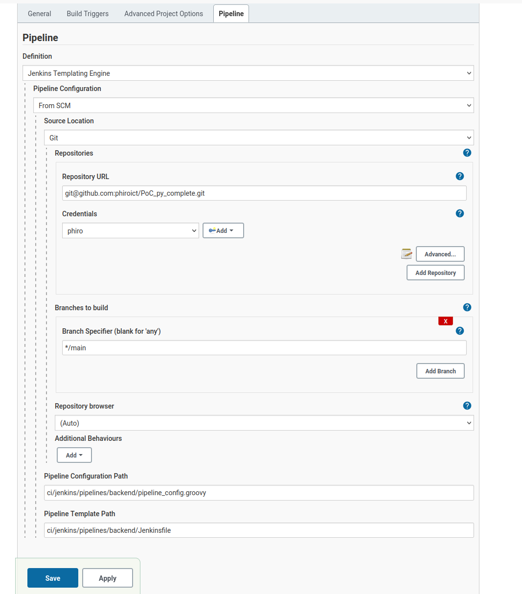
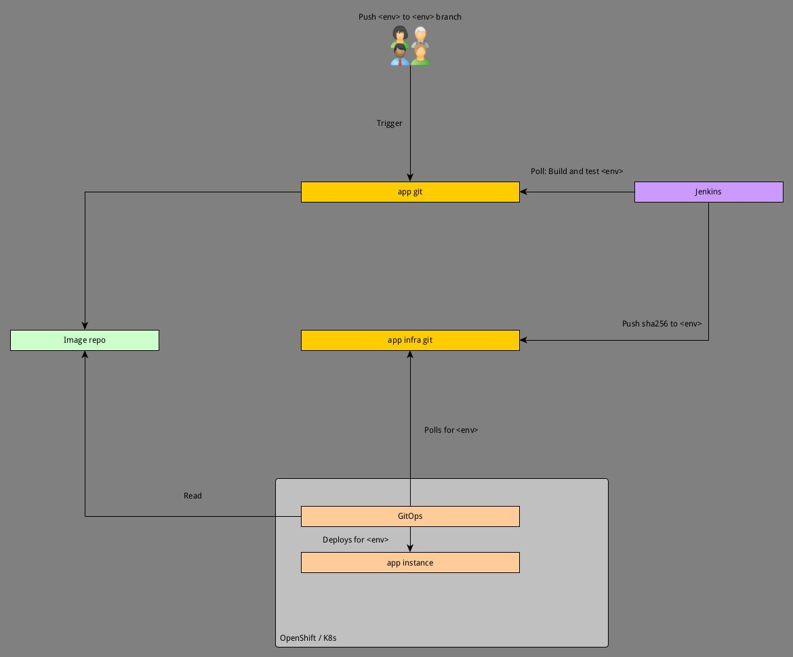

# PoC Jenkins - ArcoCD integration 

This PoC handles with the integration of Jenkins with argoCD in conjunction by order of infra git repo updates. 

Confused? You won't be after this PoC! [Cue music](https://www.google.com/url?sa=t&rct=j&q=&esrc=s&source=video&cd=&cad=rja&uact=8&ved=2ahUKEwimydTsvZPzAhWaf30KHU-fCLwQtwJ6BAgHEAM&url=https%3A%2F%2Fwww.youtube.com%2Fwatch%3Fv%3D0BHQT3Omqtw&usg=AOvVaw3WgRyttiZzPO7aB40GuhsW)!


# Setup

Get the project, make sure you take the submodules with it.

`git clone --recurse-submodules -j8 git@github.com:phiroict/PoC_py_complete.git`

The components are: 
- Backend, Frontend : Two Apps + Dockerfile build file 
- Ci : Jenkins container and utils
- infa : Two projects, Kustomize projects for backend and frontend
- Make file that builds most the apps (there is a separate in the ci folder)

Run `run init` to create some of the folders we need later. 


# Pre reqs


## Minikube

This PoC is based on minikube, install this first together with kubectl and argocd commandline. 
Install and then start with: 

```bash
minikube start
```
Get the dashboard with: 
```bash
minikube dashboard
```


## Install argocd
Commandline (archlinux) : 
```bash
yay -S argocd
```

Install the kubernetes argocd set

```bash
kubectl create namespace argocd
kubectl apply -n argocd -f https://raw.githubusercontent.com/argoproj/argo-cd/stable/manifests/install.yaml
```

Create loadbalancer and export the ports

```bash
kubectl patch svc argocd-server -n argocd -p '{"spec": {"type": "LoadBalancer"}}'
```
or do port forwarding:

```bash
kubectl port-forward svc/argocd-server -n argocd 8080:443
```

Now get the secret for login

```bash
kubectl -n argocd get secret argocd-initial-admin-secret -o jsonpath="{.data.password}" | base64 -d
```
Get the server ips (for instance):
```text
kubectl get services -n argocd

# Take the one for the argocd-server
argocd-server           ClusterIP   *10.109.77.114*   <none>        80/TCP,443/TCP               125m
```

Then logon by (for instance)
```bash
argocd login 10.109.77.114
```

or by the forwarded ports 
```bash
argocd login localhost:8080
```
And open the site: 
```bash
firefox http://localhost:8080
```

More info about argocd at:
```bash
https://argoproj.github.io/argo-cd/getting_started/
```

## Setting up argocd

First add the repos

```bash
argocd repo add git@github.com:phiroict/PoC_py_backend_infra.git --ssh-private-key-path /home/phiro/.ssh/id_rsa_poc_jenkins
argocd repo add git@github.com:phiroict/PoC_py_frontend_infra.git --ssh-private-key-path /home/phiro/.ssh/id_rsa_poc_jenkins
```

Now create the argocd applications 
We need the infra projects for these: 

```bash
argocd app create cd-backend-prod --repo git@github.com:phiroict/PoC_py_backend_infra.git --path kustomize/overlays/prod --dest-server https://kubernetes.default.svc --dest-namespace gitops-demo-prod
argocd app create cd-frontend-prod --repo git@github.com:phiroict/PoC_py_frontend_infra.git --path kustomize/overlays/prod --dest-server https://kubernetes.default.svc --dest-namespace gitops-demo-prod
argocd app create cd-backend-nonprod --repo git@github.com:phiroict/PoC_py_backend_infra.git --path kustomize/overlays/nonprod --dest-server https://kubernetes.default.svc --dest-namespace gitops-demo-nonprod
argocd app create cd-frontend-nonprod --repo git@github.com:phiroict/PoC_py_frontend_infra.git --path kustomize/overlays/nonprod --dest-server https://kubernetes.default.svc --dest-namespace gitops-demo-nonprod
argocd app create cd-backend-dev --repo git@github.com:phiroict/PoC_py_backend_infra.git --path kustomize/overlays/dev --dest-server https://kubernetes.default.svc --dest-namespace gitops-demo-dev --sync-policy auto
argocd app create cd-frontend-dev --repo git@github.com:phiroict/PoC_py_frontend_infra.git --path kustomize/overlays/dev --dest-server https://kubernetes.default.svc --dest-namespace gitops-demo-dev --sync-policy auto


```

## Jenkins setup

Run the `make build` and `make run` tasks from the `ci/jenkins/container` 

The process ends with a temporary password for the `admin` user. Log in and install the recommended plugins, set the account password   
Note that this container uses a volume to store the settings so you need to do the setup once until you delete the volume.  


Now define an agent to a machine that runs docker, for the PoC this would be the host machine on `172.17.0.1` create an ssh keypair and add the public,
this omits the need to run docker in docker. It is also bad form to run any pipeline on the Jenkins master. (Though I assume they 
have an opinion to connect up to the docker host to run the agents, c'est la vie)  

key to the `authorized_keys` file while setting up the agent with ssh, username and ssh keypair. 
Note that the authorized_keys file needs to be in `0400` mode to have ssh read it.
As agent folder select the `ci/jenkins/agent-smith` as this one is already excluded from storing in git. 


On start install the following plugins (We need them for the pipelines)
```bash
jenkins-plugin-cli --plugins basic-branch-build-strategies bitbucket build-name-setter checkmarx cobertura copyartifact docker-workflow htmlpublisher http_request job-dsl kubernetes kubernetes-cli kubernetes-credentials performance sonar ssh-credentials templating-engine ws-cleanup xunit pipeline-utility-steps
```
Or install these by the GUI plugins installer, whatever serves you best. 


You need to have docker and sshd running on the node to have this working. 

### Permissions

In the scriptApproval screen add these approvals: 
```text
method groovy.lang.GroovyObject invokeMethod java.lang.String java.lang.Object
method hudson.model.Job getBuildByNumber int
method hudson.model.Run getLogFile
method jenkins.model.Jenkins getItemByFullName java.lang.String
staticMethod jenkins.model.Jenkins getInstance
staticMethod org.codehaus.groovy.runtime.DefaultGroovyMethods getText java.io.File
```

### Create pipelines. 

There are two pipelines defined in the `ci/jenkins/pipelines/backend` and `ci/jenkins/pipelines/frontend`
In jenkins create the two pipelines. 
Like this: 


Keep all the default values, you may add a description, we add scheduling later. 

Do the same for the other one but replace the Pipeline Template Path to `ci/jenkins/pipelines/frontend/Jenkinsfile` 
Name the first one `CI-backend` and the other `CI-frontend`. The rest of the docs refers to these names so if you choose another name, remember and map these names.  

# Plan PoC
## diagram




Steps to do:  
- Ok: Set up example apps according to `https://www.densify.com/kubernetes-tools/kustomize`
- Ok: Design app
- Ok: Create main project with submodules.
- Ok: Set up pipeline in make
  - Ok : Push sha to infra repo
- Ok: Setup gitops to trigger the build
- Ok: Build jenkins image
- Ok: Build jenkins pipeline
- In progress: End to end test


# Starting and stopping stack after setup
## Quick reload
When all is setup these are the steps to start the stack.
Assumes all the prereqs set up;
```bash
make start_stack
```

And then to log in on argocd commandline
```bash
make argo_login
```
Stop the stack with

```bash
make stop_stack
```

The make file executes these steps:


```bash
# Start the host services
make workspace_init

# Start minishift
minikube start

# Start dashboard
nohup minikube dashboard & 

# In separateshell, forward arcocd port
nohup kubectl port-forward svc/argocd-server -n argocd 8080:443&

# Get the admin password
ARGOCD_PASS=$(kubectl -n argocd get secret argocd-initial-admin-secret -o jsonpath="{.data.password}" | base64 -d)

# Login on argocd
argocd login localhost:8080 --insecure --username admin --password $ARGOCD_PASS 

# Open browser
nohup firefox http://localhost:8080&

# start Jenkins 
cd ci/jenkins/container && make run 

# login 
nohup firefox http://localhost:8081& 
```


# Components Apps 

## Frontend 

`git@github.com:phiroict/PoC_py_frontend.git`

## Backend

`git@github.com:phiroict/PoC_py_backend.git`

# Components infra

PoC_py_backend_infra

## Backend
`git remote add origin git@github.com:phiroict/PoC_py_backend_infra.git`

## Frontend
`git remote add origin git@github.com:phiroict/PoC_py_frontend_infra.git`


## Main project

git submodule add git@github.com:phiroict/PoC_py_backend.git backend
git submodule add git@github.com:phiroict/PoC_py_frontend.git frontend
git submodule add git@github.com:phiroict/PoC_py_backend_infra.git infra/backend
git submodule add git@github.com:phiroict/PoC_py_frontend_infra.git infra/frontend


# Test and access 

Export the services with: 

```bash
minikube tunnel
```

Exports (from the services page) Note that your ip addresses will be different, you can get them from the services page)
- dev: http://10.98.20.103:5000/
- nonprod: http://10.110.11.224:5000/
- prod: http://10.99.133.247:5000/

# Cleanup

## Delete gitops

```bash
argocd app delete cd-frontend-prod --cascade -y
argocd app delete cd-backend-prod --cascade -y
argocd app delete cd-frontend-nonprod --cascade -y
argocd app delete cd-backend-nonprod --cascade -y
argocd app delete cd-frontend-dev --cascade -y
argocd app delete cd-backend-dev --cascade -y

```